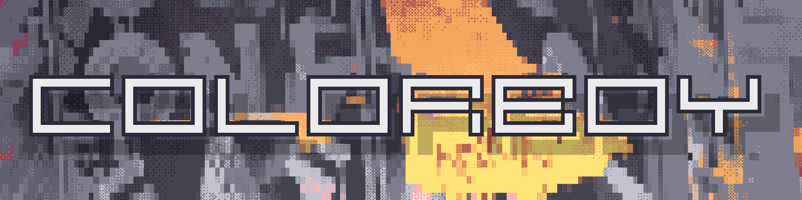
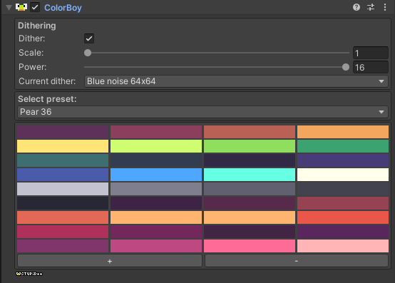
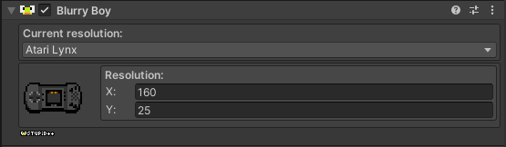

#  
`Stylisation on demand.`

# First off...
## What is this?
Colorboy is a small collection of image effects that allow for easy stylisation of your projects in Unity.

## How do I use Colorboy?
Simply import the UnityPackage from the releases tab and add one of the components onto your camera.

## The components.
### Colorboy
For changing color palettes.

### Blurryboy
For changing resolutions.

# Examples

## Demo
Play the Colorboy demo on [Itch.io](https://stupidplusplus.itch.io/colorboy).

## Credit
Colorboy shader and Blurryboy based on [Retro Suite 3D](https://github.com/oxysoft/RetroSuite3D).

Dither Shader shader based on [Kino Binary](https://github.com/keijiro/KinoBinary) and [Ompuco's dithering shader](https://ompuco.wordpress.com/2018/04/25/dithering-part-i/).

## Future plans
I really enjoyed working on this project, especially since, being a programmer, I am not that great at creating great visuals for games. This tool really simplified making stuff look good for me. I will definitely keep working on it into the future.

## Last but not least...
I hope you'll have fun playing with this. Peace out✌🏻!